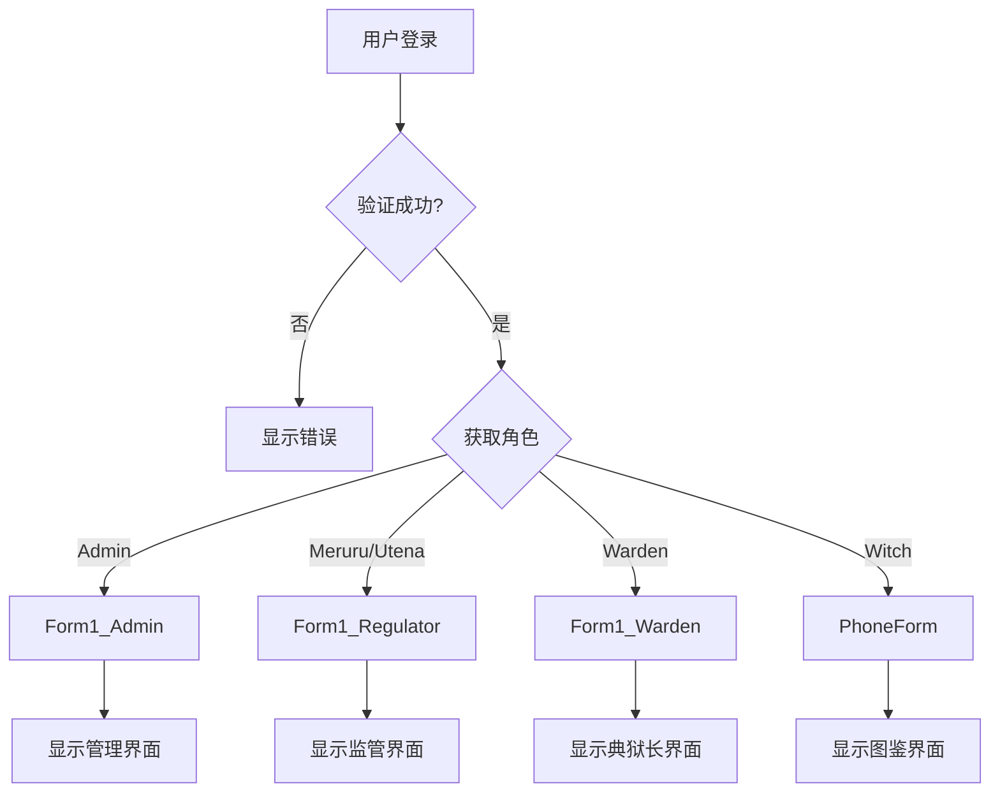
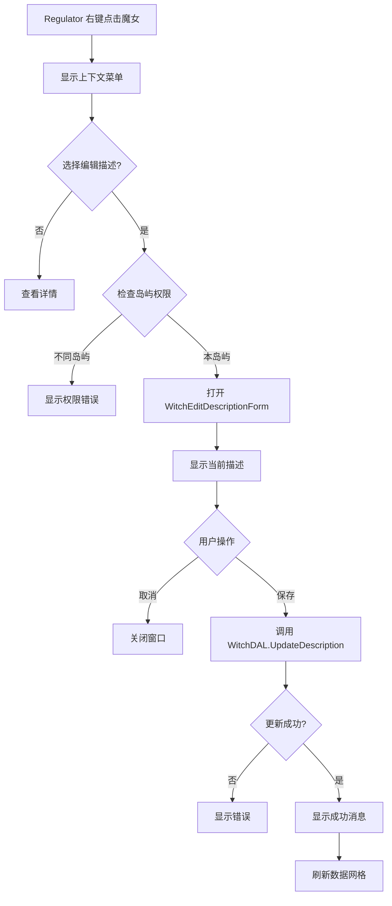

# Design Document

## Overview

本设计文档描述了魔女审判系统角色界面分离功能的技术实现方案。该功能将现有的单一 Form1 界面分离为三个独立的角色专用界面（Form1_Admin、Form1_Regulator、Form1_Warden），并为 Regulator 角色添加编辑魔女公开描述的功能。

设计采用"复制-修改"策略，最小化风险，确保现有功能不受影响。每个角色界面将固定其角色名称，简化权限逻辑。

## Architecture

### 系统架构层次

```
UI Layer (表示层)
├── LoginForm.cs                    # 登录界面，负责角色路由
├── Form1_Admin.cs                  # 管理员专用界面
├── Form1_Regulator.cs              # 监管员专用界面（新增编辑功能）
├── Form1_Warden.cs                 # 典狱长专用界面
├── WitchEditDescriptionForm.cs     # 编辑描述窗口（新增）
└── PhoneForm.cs                    # 魔女图鉴界面

BLL Layer (业务逻辑层)
├── UserBLL.cs                      # 用户业务逻辑
└── IconHelper.cs                   # 图标辅助类

DAL Layer (数据访问层)
├── WitchDAL.cs                     # 魔女数据访问（新增 UpdateDescription）
├── UserProfileDAL.cs               # 用户配置数据访问
└── PermissionDAL.cs                # 权限数据访问
```

### 角色路由流程



### 编辑描述功能流程



## Components and Interfaces

### 1. Form1_Admin / Form1_Regulator / Form1_Warden

**职责**: 角色专用主界面

**构造函数**:
```csharp
public Form1_Admin(string username)
public Form1_Regulator(string username)
public Form1_Warden(string username)
```

**关键字段**:
- `_username`: 当前用户名
- `_roleName`: 固定角色名称（"Admin" / "Regulator" / "Warden"）
- `_canManage`: 是否有管理权限（基于角色）
- `_currentIslandId`: 当前选中的岛屿ID（用于权限检查）

**关键方法**:
- `LoadUserCard()`: 加载用户信息卡片
- `LoadIslands()`: 加载岛屿列表
- `LoadBatches()`: 加载批次列表
- `LoadGrid()`: 加载魔女数据网格
- `OnAddWitch()`: 新增魔女
- `OnChangeWitchStatus()`: 更改魔女状态
- `Grid_CellDoubleClick()`: 双击查看详情

**Form1_Regulator 特有方法**:
- `InitializeContextMenu()`: 初始化右键菜单
- `EditDescription_Click()`: 编辑描述事件处理
- `ViewDetail_Click()`: 查看详情事件处理

### 2. WitchEditDescriptionForm

**职责**: 编辑魔女公开描述的专用窗口

**构造函数**:
```csharp
public WitchEditDescriptionForm(int witchId, string witchName, string prisonerNo, string currentDescription)
```

**UI 组件**:
- `_lblInfo`: 显示魔女基本信息（姓名、囚犯编号）
- `_txtDescription`: 多行文本框，用于编辑描述
- `lblCount`: 字数统计标签
- `_btnSave`: 保存按钮
- `_btnCancel`: 取消按钮

**关键方法**:
```csharp
private void InitializeComponent()      // 初始化UI组件
private void LoadData(string currentDescription)  // 加载当前描述
private void BtnSave_Click(object sender, EventArgs e)  // 保存修改
```

**窗口属性**:
- Size: 600x500
- FormBorderStyle: FixedDialog
- StartPosition: CenterParent
- MaximizeBox: false
- MinimizeBox: false

### 3. WitchDAL (扩展)

**新增方法**:
```csharp
public void UpdateDescription(int witchId, string description)
```

**SQL 语句**:
```sql
UPDATE wt.Witch 
SET DescriptionPublic = @description 
WHERE WitchID = @witchId
```

**参数**:
- `@description`: 新的描述内容（可为 null）
- `@witchId`: 魔女ID

### 4. LoginForm (修改)

**修改方法**: `OnLogin`

**角色路由逻辑**:
```csharp
switch (roleName)
{
    case "Admin":
        new Form1_Admin(username).Show();
        break;
    case "Meruru":
    case "Utena":
        new Form1_Regulator(username).Show();
        break;
    case "Warden":
        new Form1_Warden(username).Show();
        break;
    default:
        new PhoneForm(username).Show();
        break;
}
```

## Data Models

### Witch 表相关字段

```csharp
public class WitchData
{
    public int WitchID { get; set; }
    public string PrisonerNo { get; set; }
    public string Name { get; set; }
    public int IslandID { get; set; }
    public int BatchID { get; set; }
    public string DescriptionPublic { get; set; }  // 公开描述字段
    // ... 其他字段
}
```

### 权限检查数据

```csharp
public class PermissionCheck
{
    public int UserIslandId { get; set; }      // 用户所属岛屿
    public int WitchIslandId { get; set; }     // 魔女所属岛屿
    public bool CanEdit => UserIslandId == WitchIslandId;
}
```

## Corre
ctness Properties

*A property is a characteristic or behavior that should hold true across all valid executions of a system-essentially, a formal statement about what the system should do. Properties serve as the bridge between human-readable specifications and machine-verifiable correctness guarantees.*

### Property 1: Constructor parameter acceptance

*For any* role-specific form (Admin, Regulator, Warden) and any valid username string, instantiating the form with that username should result in the form storing the username correctly.
**Validates: Requirements 1.3**

### Property 2: Permission enforcement for cross-island editing

*For any* Regulator user and any witch not assigned to the Regulator's island, attempting to edit the witch's description should be blocked with an error message.
**Validates: Requirements 3.3**

### Property 3: Description update persistence

*For any* valid witch ID and description text, when a Regulator saves the description through WitchEditDescriptionForm, the DescriptionPublic field in the database should be updated to match the new value.
**Validates: Requirements 3.4**

### Property 4: UI refresh after update

*For any* successful description update, the data grid should refresh and display the new description value.
**Validates: Requirements 3.5**

### Property 5: Form initialization with witch data

*For any* witch, when WitchEditDescriptionForm is opened, the form should display the witch's name, prisoner number, and current description.
**Validates: Requirements 4.1**

### Property 6: Character count accuracy

*For any* text input in the description text box, the displayed character count should equal the length of the text.
**Validates: Requirements 4.2**

### Property 7: Save operation execution

*For any* valid description text, when the user clicks the save button, the system should call WitchDAL.UpdateDescription with the correct witch ID and description.
**Validates: Requirements 4.3**

### Property 8: Success dialog behavior

*For any* successful save operation, the form should display a success message and close with DialogResult.OK.
**Validates: Requirements 4.4**

### Property 9: Error handling on save failure

*For any* failed save operation, the system should display an error message containing the exception details.
**Validates: Requirements 4.5**

### Property 10: DAL update execution

*For any* valid witch ID and description, calling WitchDAL.UpdateDescription should execute an UPDATE statement on the wt.Witch table.
**Validates: Requirements 5.1**

### Property 11: Non-null description storage

*For any* non-null description string, calling WitchDAL.UpdateDescription should store the exact string value in the DescriptionPublic column.
**Validates: Requirements 5.3**

### Property 12: Exception on update failure

*For any* database error during update, WitchDAL.UpdateDescription should throw an exception with error details.
**Validates: Requirements 5.5**

### Property 13: User card display consistency

*For any* valid user, when a role-specific form loads, the user card should display the avatar, username, role name, and Chinese name.
**Validates: Requirements 6.1**

### Property 14: Permission-based data loading

*For any* user, when a role-specific form loads, the system should only load islands, batches, and witch data that the user has permission to access.
**Validates: Requirements 6.2**

### Property 15: Search logic consistency

*For any* search query, all role-specific forms should apply the same filtering logic to produce consistent results.
**Validates: Requirements 6.3**

### Property 16: Detail view navigation

*For any* witch row in the data grid, double-clicking should open WitchDetailForm with the selected witch's complete information.
**Validates: Requirements 6.4**

### Property 17: Refresh with filter preservation

*For any* active filter settings, clicking the refresh button should reload the data grid while maintaining those filter settings.
**Validates: Requirements 6.5**

## Error Handling

### 1. Permission Errors

**场景**: Regulator 尝试编辑其他岛屿的魔女

**处理策略**:
- 在 `EditDescription_Click` 方法中检查 `witchIslandId != _currentIslandId`
- 显示友好的错误消息："您只能编辑本岛屿的魔女信息"
- 不打开编辑窗口
- 记录审计日志（可选）

### 2. Database Update Errors

**场景**: 数据库更新失败（连接断开、约束违反等）

**处理策略**:
- 在 `WitchDAL.UpdateDescription` 中捕获 `SqlException`
- 向上抛出异常，包含详细错误信息
- 在 `WitchEditDescriptionForm.BtnSave_Click` 中捕获异常
- 显示错误消息框，包含异常详情
- 不关闭编辑窗口，允许用户重试

### 3. Form Initialization Errors

**场景**: 加载用户信息或魔女数据失败

**处理策略**:
- 在 `Form1_Load` 中使用 try-catch 包裹初始化代码
- 捕获异常后在状态栏显示错误信息
- 设置状态栏颜色为红色以引起注意
- 允许用户手动刷新重试

### 4. Null Reference Errors

**场景**: 数据库返回 null 值或用户未选择行

**处理策略**:
- 使用 null-conditional 操作符 (`?.`) 和 null-coalescing 操作符 (`??`)
- 在操作前检查 `_grid.SelectedRows.Count > 0`
- 对于可能为 null 的数据库字段，使用 `DBNull.Value` 检查
- 提供默认值（如 "—" 或空字符串）

### 5. File Not Found Errors (Avatar)

**场景**: 用户头像文件不存在

**处理策略**:
- 在 `LoadUserCard` 中使用 `File.Exists` 检查
- 如果文件不存在，加载占位图 `Images/_placeholder.png`
- 如果占位图也不存在，保持 PictureBox 为空
- 不显示错误消息，静默处理

## Testing Strategy

### Unit Testing

本项目将使用 **NUnit** 作为单元测试框架。

#### 测试范围

1. **WitchDAL.UpdateDescription 方法**
   - 测试正常更新流程
   - 测试 null 描述处理
   - 测试无效 witch ID 处理

2. **LoginForm 角色路由逻辑**
   - 测试 Admin 路由到 Form1_Admin
   - 测试 Meruru/Utena 路由到 Form1_Regulator
   - 测试 Warden 路由到 Form1_Warden
   - 测试 Witch 路由到 PhoneForm

3. **权限检查逻辑**
   - 测试同岛屿编辑权限
   - 测试跨岛屿编辑拒绝

#### 示例测试

```csharp
[TestFixture]
public class WitchDALTests
{
    [Test]
    public void UpdateDescription_ValidInput_UpdatesDatabase()
    {
        // Arrange
        var dal = new WitchDAL();
        int witchId = 1;
        string newDescription = "Test description";
        
        // Act
        dal.UpdateDescription(witchId, newDescription);
        
        // Assert
        var result = dal.GetWitchDetail(witchId);
        Assert.AreEqual(newDescription, result.Rows[0]["DescriptionPublic"]);
    }
    
    [Test]
    public void UpdateDescription_NullDescription_StoresDBNull()
    {
        // Arrange
        var dal = new WitchDAL();
        int witchId = 1;
        
        // Act
        dal.UpdateDescription(witchId, null);
        
        // Assert
        var result = dal.GetWitchDetail(witchId);
        Assert.IsTrue(result.Rows[0]["DescriptionPublic"] == DBNull.Value);
    }
}
```

### Property-Based Testing

本项目将使用 **FsCheck** (C# 版本) 作为属性测试框架。每个属性测试将运行至少 **100 次迭代**。

#### 测试配置

```csharp
[Property(MaxTest = 100)]
public Property PropertyName()
{
    // Property implementation
}
```

#### 属性测试标注格式

每个属性测试必须使用以下格式标注：

```csharp
// **Feature: role-based-ui-separation, Property 1: Constructor parameter acceptance**
```

#### 测试范围

1. **Property 1: Constructor parameter acceptance**
   - 生成随机用户名字符串
   - 实例化三种角色表单
   - 验证用户名正确存储

2. **Property 3: Description update persistence**
   - 生成随机 witch ID 和描述文本
   - 调用 UpdateDescription
   - 验证数据库中的值匹配

3. **Property 6: Character count accuracy**
   - 生成随机文本字符串
   - 模拟文本框输入
   - 验证字符计数等于文本长度

4. **Property 11: Non-null description storage**
   - 生成随机非空描述字符串
   - 调用 UpdateDescription
   - 验证数据库存储的值完全匹配

5. **Property 15: Search logic consistency**
   - 生成随机搜索查询
   - 在三个角色表单中执行相同搜索
   - 验证结果集一致（考虑权限差异）

#### 示例属性测试

```csharp
[Property(MaxTest = 100)]
public Property CharacterCountMatchesTextLength()
{
    // **Feature: role-based-ui-separation, Property 6: Character count accuracy**
    
    return Prop.ForAll<string>(text =>
    {
        // Arrange
        var form = new WitchEditDescriptionForm(1, "Test", "001", "");
        var txtDescription = GetPrivateField<TextBox>(form, "_txtDescription");
        
        // Act
        txtDescription.Text = text ?? "";
        
        // Assert
        var lblCount = GetPrivateField<Label>(form, "lblCount");
        return lblCount.Text.Contains(txtDescription.Text.Length.ToString());
    });
}
```

### Integration Testing

集成测试将验证完整的用户工作流：

1. **登录到角色界面流程**
   - 登录 → 验证 → 路由到正确界面

2. **编辑描述完整流程**
   - 右键菜单 → 打开编辑窗口 → 修改 → 保存 → 刷新显示

3. **权限检查流程**
   - 尝试编辑其他岛屿魔女 → 验证拒绝

## Implementation Notes

### 文件复制策略

使用 PowerShell 脚本批量复制文件：

```powershell
# 备份原文件
Copy-Item Form1.cs Form1_Backup.cs
Copy-Item Form1.Designer.cs Form1_Backup.Designer.cs
Copy-Item Form1.resx Form1_Backup.resx

# 创建角色专用文件
$roles = @("Admin", "Regulator", "Warden")
foreach ($role in $roles) {
    Copy-Item Form1.cs "Form1_$role.cs"
    Copy-Item Form1.Designer.cs "Form1_$role.Designer.cs"
    Copy-Item Form1.resx "Form1_$role.resx"
}
```

### 类名替换策略

使用正则表达式批量替换：

```csharp
// 在每个 Form1_*.cs 文件中
// 查找: public partial class Form1
// 替换: public partial class Form1_Admin (或 Regulator, Warden)

// 在每个 Form1_*.Designer.cs 文件中
// 查找: partial class Form1
// 替换: partial class Form1_Admin (或 Regulator, Warden)
```

### 构造函数修改

每个角色表单的构造函数固定角色名称：

```csharp
public Form1_Admin(string username)
{
    _username = username;
    InitializeComponent();
    _roleName = "Admin";  // 固定角色
    // ... 其他初始化
}
```

### 项目文件更新

在 `.csproj` 中添加新文件引用：

```xml
<ItemGroup>
  <Compile Include="Form1_Admin.cs">
    <SubType>Form</SubType>
  </Compile>
  <Compile Include="Form1_Admin.Designer.cs">
    <DependentUpon>Form1_Admin.cs</DependentUpon>
  </Compile>
  <!-- Regulator 和 Warden 类似 -->
</ItemGroup>

<ItemGroup>
  <EmbeddedResource Include="Form1_Admin.resx">
    <DependentUpon>Form1_Admin.cs</DependentUpon>
  </EmbeddedResource>
  <!-- Regulator 和 Warden 类似 -->
</ItemGroup>

<ItemGroup>
  <Compile Include="UI\WitchEditDescriptionForm.cs">
    <SubType>Form</SubType>
  </Compile>
</ItemGroup>
```

### 性能考虑

1. **数据加载优化**
   - 使用 `DataView` 进行客户端筛选，减少数据库查询
   - 缓存岛屿和批次列表，避免重复加载

2. **UI 响应性**
   - 使用 `BeginInvoke` 进行异步 UI 更新
   - 在长时间操作时显示进度指示器

3. **内存管理**
   - 及时释放 `Image` 对象
   - 使用 `using` 语句管理数据库连接

## Security Considerations

### 1. 权限验证

- 在服务器端（DAL 层）验证权限，不仅依赖 UI 层
- 每次数据库操作前检查用户权限
- 记录所有权限拒绝事件到审计日志

### 2. SQL 注入防护

- 使用参数化查询（`SqlParameter`）
- 不拼接用户输入到 SQL 语句
- 验证和清理所有用户输入

### 3. 数据访问控制

- Regulator 只能访问分配的岛屿数据
- Admin 可以访问所有数据
- Warden 可以访问所有岛屿但功能受限

### 4. 审计日志

- 记录所有描述修改操作
- 包含用户名、时间戳、修改前后的值
- 使用 `AuditDAL.Log` 方法

## Deployment Considerations

### 1. 数据库迁移

无需数据库架构变更，`DescriptionPublic` 字段已存在。

### 2. 向后兼容性

- 保留原 Form1.cs 作为备份
- 如需回滚，可快速恢复
- 新旧版本可以共存（通过配置切换）

### 3. 用户培训

- 为 Regulator 角色提供编辑描述功能的使用说明
- 强调权限限制（只能编辑本岛屿魔女）
- 提供操作演示视频或文档

### 4. 测试环境

- 在测试数据库上先部署和测试
- 验证所有角色的登录和功能
- 测试权限边界情况

## Future Enhancements

### 1. 富文本编辑

- 支持 Markdown 或 HTML 格式
- 添加格式化工具栏
- 预览功能

### 2. 版本历史

- 记录描述的修改历史
- 支持查看和恢复旧版本
- 显示修改者和时间

### 3. 批量编辑

- 支持选择多个魔女批量更新描述
- 使用模板快速填充
- 批量导入/导出功能

### 4. 审批工作流

- Regulator 提交修改申请
- Admin 审批后生效
- 支持拒绝和修改建议
